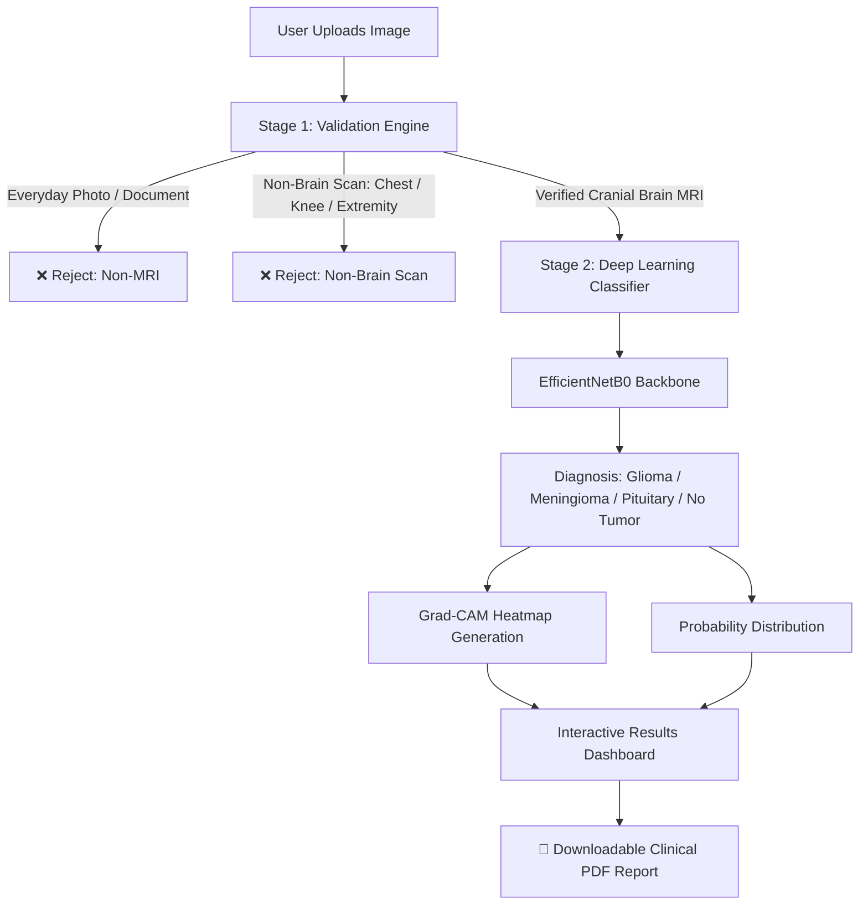

# 🧠 NeuroScan AI - Brain Tumor Detection & Classification System

[](https://share.streamlit.io)
[](https://www.python.org/)
[](https://tensorflow.org/)
[](LICENSE)

An end-to-end clinical AI decision-support platform designed to validate, classify, and explain brain MRI scans. Built using **EfficientNetB0**, **Grad-CAM visual explainability**, and a **Two-Stage Validation Engine**, **NeuroScan AI** accurately differentiates between healthy scans and 3 primary brain tumor types while rejecting non-brain images and unrelated medical radiographs.

---

## 🌟 Key Features

- **Two-Stage Intelligent Pipeline:**
  - **Stage 1 (Image Validator):** Distinguishes authentic cranial brain MRIs (Axial, Coronal, Sagittal) from everyday photos, documents, and non-brain scans (e.g., knee/leg MRIs, chest radiographs, hand scans).
  - **Stage 2 (Tumor Classifier):** Classifies verified brain scans into 4 distinct diagnostic categories:
    - `Glioma Tumor`
    - `Meningioma Tumor`
    - `Pituitary Tumor`
    - `No Tumor (Healthy)`
- **Explainable AI with Grad-CAM:** Generates activation heatmaps superimposed on original MRI scans to visualize the exact tissue regions influencing the model's prediction.
- **Automated Clinical PDF Reports:** Instantly generates downloadable, print-ready diagnostic reports including:
  - Patient Name & Case ID
  - Original MRI Scan embed
  - Diagnosis & Confidence Score
  - Complete Probability Breakdown
  - Clinical Overview of the diagnosed condition
- **Batch Processing:** Upload and analyze multiple MRI scans simultaneously.
- **Premium Dark-Themed UI:** Responsive, medical-grade interface built with modern Streamlit and custom CSS.

---

## 🏗️ System Architecture



---

## 📁 Repository Structure

```
braintumorapp/
│
├── app.py                         # Main Streamlit web application & workflow
├── model.py                       # Stage 1 Validator, Stage 2 Inference, and Grad-CAM
├── pdf_report.py                  # ReportLab clinical PDF generator
├── styles.py                      # Custom dark-theme CSS & responsive styling
├── brain_tumor_model_final.keras  # Trained EfficientNetB0 Brain Tumor model (~21 MB)
├── requirements.txt               # Pinned Python package dependencies
├── .gitignore                     # Git ignore file
├── README.md                      # Project documentation
└── assets/
    └── banner.png                 # Application header banner
```

---

## ⚙️ Installation & Local Setup

### Prerequisites
- Python 3.10, 3.11, or 3.12
- Git

### 1. Clone the Repository
```bash
git clone https://github.com/<YOUR-USERNAME>/braintumorapp.git
cd braintumorapp
```

### 2. Create a Virtual Environment
```bash
# Windows
python -m venv venv
venv\Scripts\activate

# macOS / Linux
python3 -m venv venv
source venv/bin/activate
```

### 3. Install Dependencies
```bash
pip install -r requirements.txt
```

### 4. Run the Streamlit Application
```bash
streamlit run app.py
```

Open your browser and navigate to `http://localhost:8501`.

---

## ☁️ Deployment Guide (Streamlit Cloud)

1. Push your repository to **GitHub**:
   ```bash
   git init
   git add .
   git commit -m "Initial commit"
   git branch -M main
   git remote add origin https://github.com/<YOUR-USERNAME>/braintumorapp.git
   git push -u origin main
   ```
2. Navigate to **[share.streamlit.io](https://share.streamlit.io)** and log in with GitHub.
3. Click **"New app"** and configure:
   - **Repository:** `<YOUR-USERNAME>/braintumorapp`
   - **Branch:** `main`
   - **Main file path:** `app.py`
4. Under **Advanced Settings**, select **Python 3.11** or **3.12**.
5. Click **"Deploy!"** — your app will be live with a shareable URL in minutes.

---

## 🧪 Model Specifications

- **Model Architecture:** EfficientNetB0 Feature Extractor + Dense Head (256 units, BatchNormalization, Dropout 0.3) + Softmax (4 classes)
- **Input Resolution:** $224 \times 224 \times 3$
- **Preprocessing:** Standard EfficientNet zero-centering & scaling
- **Interpretability:** Convolutional layer gradient extraction (Grad-CAM) with Jet colormap superimposition

---

## 🩺 Clinical Disclaimer

> **IMPORTANT NOTICE:** This application is intended solely for academic, research, and educational demonstration purposes. It is **not** a certified medical diagnostic device and should never replace professional medical judgment, consultation, or diagnosis by a licensed radiologist or physician.

---

## 📄 License

This project is licensed under the **MIT License** — see the [LICENSE](LICENSE) file for details.
